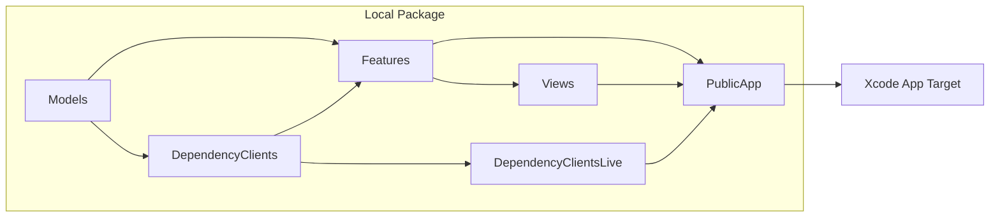
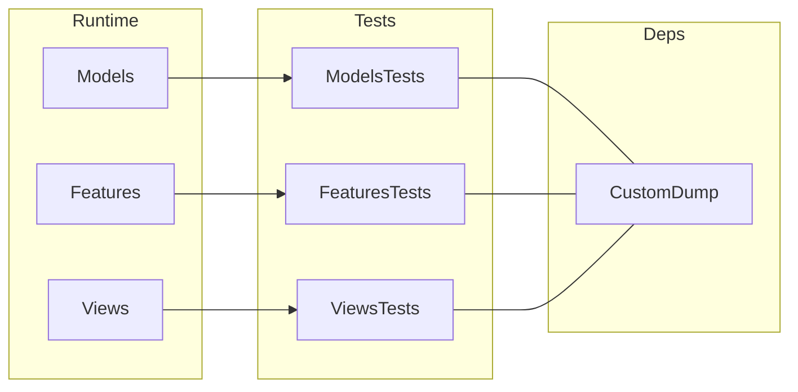

# SwiftUI + Observation Template

A template project for building iOS/macOS apps with SwiftUI and Apple's Observation framework, featuring a modular package structure for better maintainability and scalability.

## Features

- 📦 Local Swift Package with modular architecture
- 👀 Observation-based state management
- 🎯 iOS 26 & macOS 26 support
- ✅ Includes test target setup
- 📱 Ready-to-use app structure
- 🗃️ SwiftData (official APIs only): `ModelContainer`, `@Query`, `modelContext`

## Project Structure

The template uses a modular architecture with clear separation of concerns:

Test targets are separate from runtime modules:

### Module Description

- `Models`: Core data models and business logic
- `Features`: Observation-backed application models
- `Views`: SwiftUI views and UI components
- `DependencyClients`: Dependency client interfaces (native DI)
- `DependencyClientsLive`: Live implementations of dependency clients
- `PublicApp`: Main app module that ties everything together

## Getting Started

1. Clone this template repository
2. Update `appName` in `Package.swift`
3. Run `swift package resolve` to fetch dependencies
4. Build and run the project
5. Create an iOS project in Xcode and import the package. The app target only needs an empty Swift file.
6. Develop your app with code organized as modules in the package.

### Tips

1. When adding a new feature, create a new `@Observable` model in `Features`. You can TDD it by adding tests in the `FeaturesTests` module. You can build and test `Features` scheme without building the whole app.
2. When developing a new view, create a new SwiftUI view in the `Views` module. Leverage SwiftUI previews on `Views` to iterate on the view without building the whole app.

## SwiftData

This template uses SwiftData directly (no persistence wrapper layer):

- `PublicApp` creates a single `ModelContainer` and injects it using `.modelContainer(...)`.
- `Views` read data via `@Query` and write via `@Environment(\.modelContext)`.

## Dependencies

- [swift-custom-dump](https://github.com/pointfreeco/swift-custom-dump) (tests)

## Requirements

- iOS 26.0+ / macOS 26.0+
- Xcode 16.0+
- Swift 6.2+
